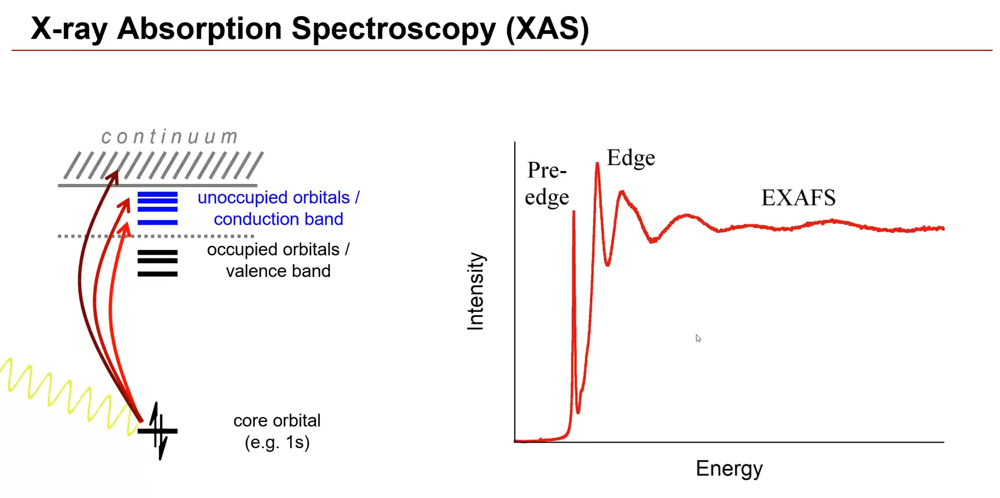

# 课程网址：

https://www.bilibili.com/video/BV1Rf4y1i76X/?spm_id_from=333.337.search-card.all.click&vd_source=e8aa330eabdfb136c4fed9514c6a6d8b  

# 课程目的：
1.什么是 XAS 光谱和 EXAFS？它们包含哪些信息？  
2.XAS 和 EXAFS 实验如何进行？样品要求是什么？  
3.XAS 和 EXAFS 数据如何处理和分析？

# X射线吸收谱基础

## 什么是X射线
  **图1.不同能量的电磁波**

图中展示了不同能量的电磁波，紫外/可见光(Uv/vis)的能量范围从1-5 eV，它只能激发离原子核较远的，在化学反应中活性较高的电子--价电子；X射线属于比较高能量的电磁波，他的能量范围从1000 eV到10000 eV，它激发的是离原子核较近的电子--核电子。

## X射线谱的特点
1.对元素选择性高--即使在复杂的微观环境中，也可以测量单个元素。  
2.能穿透到材料体相，适用于各种样品  
3.可以做时间分辨实验--微秒级到秒级  
4.能获得其他技术无法获得的化学信息

## X射线吸收谱(XAS)

**图2.XAS信号产生原理**

材料的电子结构如上所示，越往上能量越高，能量最低的是核电子，然后是价电子轨道形成的能带--价带；然后是未占据轨道--导带，也叫作束缚轨道，由于处于该轨道的电子能量比价电子高一点，仍然受到原子核的束缚；能量再高，就几乎变成没有被原子核束缚的电子了。  

如上图所示，当X射线照射到材料上时，由于其能量很高，当部分X射线被材料吸收时，会导致核电子被激发到未占据轨道，从而得到了右边的图谱。  

XAS光谱能量最低的那部分叫做前边(pre edge)，对应了核电子受激发进入低能量的空轨道;当能量继续升高，X射线的核电子被从分子中电离出来，即把电子激发到真空中，产生了非常强的带边过渡信号，如果X射线能量更高，超过带边，就会得到起伏波动的信号--EXAFS。

  
*XAS的命名*
物理学家给从不同的电子层激发出的XAS信号取了不同的名字，由1S激发的对应K边，由2S、2P激发的对应L边，第三电子层对应M边

## XAS有元素选择性的原因
每种元素的核电子轨道，只吸收特定能量的X射线,如下图所示：不同的个原子数对应的K边和L3边吸收，随着原子序数增大，激发核电子所需要的能量也增加，大体呈现抛物线的形状。幸好，每一个元素的核电子之间都有足够的距离，因此，我们才可以选择性激发某个原子而不影响其周围的原子。  
化学反应中，人们更多关注金属元素，如过渡金属、镧系元素等。右图展示了4000-16000eV的能量范围能激发的元素，在该能量区间，X射线能激发原子序数在20到40左右的元素的1S轨道电子，在该能量区间的L边，点的密度变大，可以激发从第二过渡金属到镧系元素。

  *不同元素的XAS能量*
，
把

